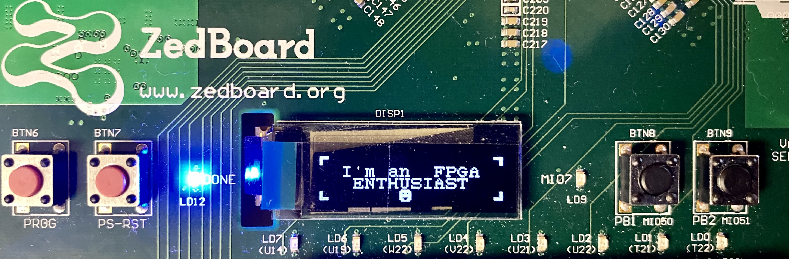

<h1 align="center">Hi 👋, I'm Kiran</h1>

 

I am currently a Ph.D. candidate at Wright State University, working as a GRA in Digital Receiver Lab. My doctoral research focuses on hardware optimization of Fast Fourier Transform (FFT) for Xilinx UltraScale+ RFSoC 1275 FPGA that performance efficient multiple signal detection in military applications, addressing challenges of computation complexity and signal resolution implemented on Xilinx UltraScale+ RFSoC 1275.

🔬 Know more about my [research](https://24x7fpga.com/research/2024_07_08_10_15_40_research/).

Check out my GitHub repositories for a mix of cool projects.

- 📁 [iVerilog](https://github.com/24x7fpga/iVerilog): This GitHub repository features RTL designs from basic to advanced level that are simulated using Icarus Verilog. 
- 📁 [VanillaFPRO](https://github.com/24x7fpga/VanillaFPRO): Serves for a basic understanding of a SoC design with a memory-mapped I/O subsystem. This repository is heavily inspired from the book [FPGA Prototyping by SystemVerilog Examples](https://www.amazon.com/FPGA-Prototyping-SystemVerilog-Examples-MicroBlaze/dp/1119282667). The SoC prototyping was conducted on the Zybo-Z7 development board
- 📁 [ZyboZ7](https://github.com/24x7fpga/ZyboZ7): This repository features design examples that are implemented on Xilinx Zynq-7000 SoC series FPGA developed by Digilent called Zybo-Z7.

⚡ Fun fact [I love photography](https://instagram.com/negativeparking).

<!-- <h3 align="left">Connect with me:</h3>

 -->

<h4 align="left">Languages and Tools:</h4>

 

 
 
 

<!-- 
  
 -->

<!-- 

&nbsp;

 -->

